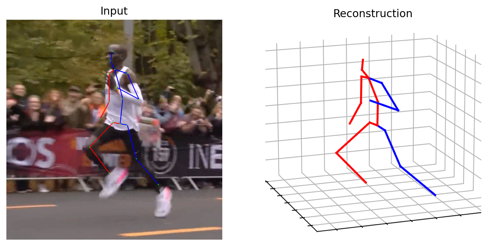

# IGANet:Interweaved Graph and Attention Network for 3D Human Pose Estimation 

<p align="center"></p>

> This paper has been accepted by IEEE International Conference on Acoustics, Speech, and Signal Processing (ICASSP), 2023.


## Results on Human3.6M
Here, we compare our IGANet with recent state-of-the-art methods on Human3.6M dataset. The 2D pose detected by cascaded pyramid network (CPN) is used as input.
We use $\S$ to highlight methods that use additional refinement module.
Evaluation metric is Mean Per Joint Position Error (MPJPE) in mm​.

|   Models    |  MPJPE   |
| :---------: | :------: |
| GraFormer   |  51.8 mm  |
| MGCN $\S$      |  49.4 mm  |
|  IGANet     | **48.3** mm |


## Dependencies

- Cudatoolkit: 10.2
- Python: 3.7.11
- Pytorch: 1.10.0 

Create conda environment:
```bash
conda env create -f environment.yml
```

## Dataset setup

### Setup from original source 
You can obtain the Human3.6M dataset from the [Human3.6M](http://vision.imar.ro/human3.6m/) website, and then set it up using the instructions provided in [VideoPose3D](https://github.com/facebookresearch/VideoPose3D). 

### Setup from preprocessed dataset (Recommended)
 You also can access the processed data by downloading it from [here](https://drive.google.com/drive/folders/112GPdRC9IEcwcJRyrLJeYw9_YV4wLdKC?usp=sharing).

```bash
${POSE_ROOT}/
|-- dataset
|   |-- data_3d_h36m.npz
|   |-- data_2d_h36m_gt.npz
|   |-- data_2d_h36m_cpn_ft_h36m_dbb.npz
```

## Test the pre-trained model
The pre-trained model can be found [here](https://drive.google.com/drive/folders/1NL7LM9aVzA05aSYCH9rsNshXO4vwcjp1?usp=sharing). please download it and put it in the 'args.previous_dir' ('./pre_trained_model')
directory.

To Test the pre-trained model on Human3.6M:
```bash
python main.py --reload --previous_dir "./pre_trained_model" --model model_IGANet --layers 3 --gpu 0
```

## Train the model from scratch

The log file, pre-trained model, and other files of each training time will be saved in the './checkpoint' folder.

For Human3.6M:

```bash
python main.py --train --model model_IGANet --layers 3 --nepoch 20 --gpu 0
```

## Demo 

This visualization code is designed for single-frame based models, making it easy for you to perform 3D human pose estimation on a single image or video.


Before starting, please complete the following preparation steps:

- Download YOLOv3 and HRNet pretrained models from [here](https://drive.google.com/drive/folders/1_ENAMOsPM7FXmdYRbkwbFHgzQq_B_NQA?usp=sharing) and place them in the './demo/lib/checkpoint' directory. 

- Copy your in-the-wild image (or video) to the './demo/image (or video)' directory.

- Make sure to place the pre-trained model in the 'args.previous_dir' ('./pre_trained_model') directory.


Testing on in-the-wild image:

```bash
python demo/vis.py --type 'image' --path './demo/images/running.png' --gpu 0
```
<p align="center"></p>


Testing on in-the-wild video:
```bash
python demo/vis.py --type 'video' --path './demo/videos/running3s.mp4' --gpu 0
```


<p align="center"></p>


## Acknowledgement

Our code is extended from the following repositories. We thank the authors for releasing the codes. 

- [MHFormer](https://github.com/Vegetebird/MHFormer)
- [StridedTransformer-Pose3D](https://github.com/Vegetebird/StridedTransformer-Pose3D)
- [ST-GCN](https://github.com/vanoracai/Exploiting-Spatial-temporal-Relationships-for-3D-Pose-Estimation-via-Graph-Convolutional-Networks)
- [VideoPose3D](https://github.com/facebookresearch/VideoPose3D)


## Licence

This project is licensed under the terms of the MIT license.
