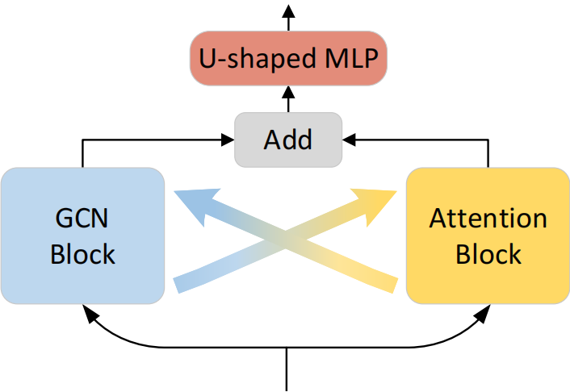

# IGANet:Interweaved Graph and Attention Network for 3D Human Pose Estimation 


<p align="center"></p>

> This paper has been accepted by IEEE International Conference on Acoustics, Speech, and Signal Processing (ICASSP), 2023.


The code will be released soon.


## Dataset setup

### Setup from original source 
You can obtain the Human3.6M dataset from the [Human3.6M](http://vision.imar.ro/human3.6m/) website, and then set it up using the instructions provided in [VideoPose3D](https://github.com/facebookresearch/VideoPose3D). 

### Setup from preprocessed dataset
 You also can access the processed data by downloading it from [here](https://drive.google.com/drive/folders/112GPdRC9IEcwcJRyrLJeYw9_YV4wLdKC?usp=sharing).

```bash
${POSE_ROOT}/
|-- dataset
|   |-- data_3d_h36m.npz
|   |-- data_2d_h36m_gt.npz
|   |-- data_2d_h36m_cpn_ft_h36m_dbb.npz
```


## Test the pre-trained model


## Train the model from scratch

For Human3.6M:

```bash
python main.py --layers 3 --gpu 0
```


## Acknowledgement

Our code is extended from the following repositories. We thank the authors for releasing the codes. 

- [MHFormer](https://github.com/Vegetebird/MHFormer)
- [VideoPose3D](https://github.com/facebookresearch/VideoPose3D)
- [StridedTransformer-Pose3D](https://github.com/Vegetebird/StridedTransformer-Pose3D)

